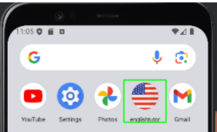
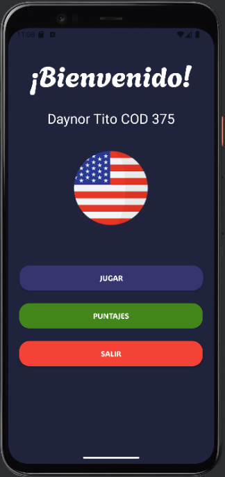
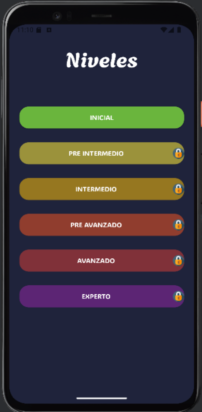
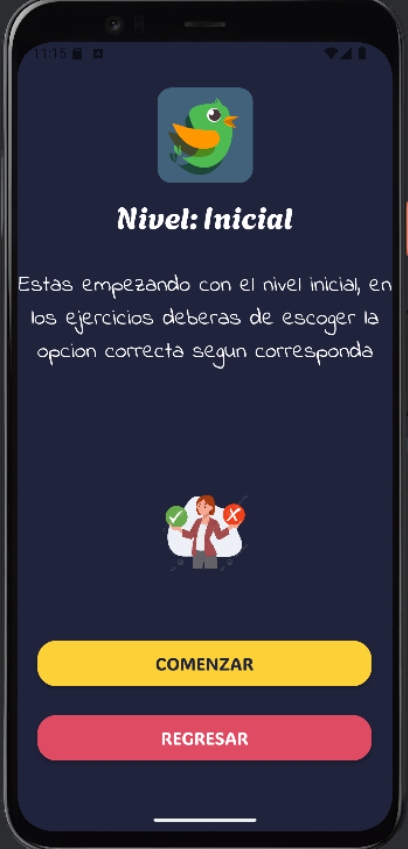
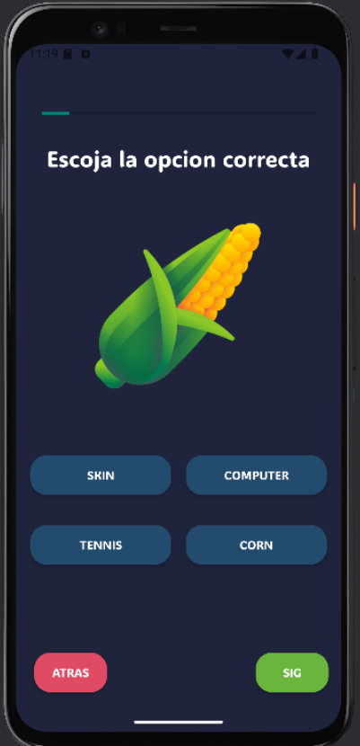
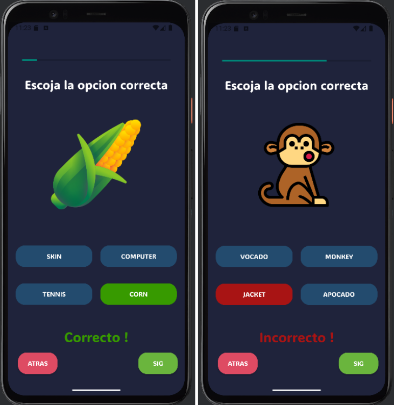
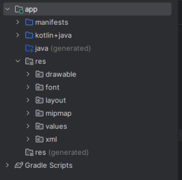

# Aplicación Tutor de Inglés para Android

Una aplicación Android interactiva diseñada para ayudar a los usuarios a mejorar su vocabulario en inglés a través de ejercicios de completación de palabras. La aplicación cuenta con múltiples niveles de dificultad y un sistema de aprendizaje progresivo. Compatible con dispositivos Android 6.0 Marshmallow y versiones posteriores, ofrece ejercicios prácticos y lecciones secuenciales que ayudan a desarrollar vocabulario y gramática.

## Características

- 6 niveles de dificultad: Inicial, Pre-Intermedio, Intermedio, Pre-Avanzado, Avanzado y Experto
- Sistema progresivo de desbloqueo de niveles
- Ejercicios interactivos de completación de palabras
- Sistema de retroalimentación visual
- Seguimiento del progreso con calificación por estrellas
- Funcionalidad sin conexión
- Interfaz amigable para el usuario

## Vistas

### Icono de la Aplicación

El icono de la aplicación se muestra de manera prominente en el menú de Android en un dispositivo Pixel 4.

### Pantalla de Inicio

La pantalla de bienvenida presenta una interfaz limpia con el fondo de la bandera de EE.UU. y tres botones principales:
- "Jugar" - Inicia el viaje de aprendizaje
- "Puntajes" - Reservado para implementación futura (V2.0)
- "Salir" - Cierra la aplicación

### Pantalla de Selección de Niveles

Muestra todos los niveles de dificultad disponibles, con los niveles superiores inicialmente bloqueados. Solo el nivel Inicial está accesible al principio, fomentando el aprendizaje progresivo. Los niveles se representan visualmente con indicadores claros de estado bloqueado/desbloqueado.

### Pantalla Pre-Juego

Muestra el nombre del nivel actual y un mensaje de bienvenida específico para el nivel elegido. Cuenta con dos botones de navegación:
- Botón de retroceso para volver a la selección de nivel
- Botón de inicio para comenzar los ejercicios

### Interfaz de Juego

La pantalla principal de juego incluye:
- Barra de progreso en la parte superior mostrando el avance en el nivel
- Desafío de palabra incompleta
- Cuatro opciones de selección múltiple
- Retroalimentación por colores (verde para correcto, rojo para incorrecto)
- Botón "Siguiente" para proceder a la siguiente pregunta

### Pantalla de Resultados

Dos posibles pantallas de resultado:
1. Nivel Incompleto:
   - Muestra las estrellas ganadas (de 5)
   - Muestra retroalimentación del desempeño
   - Opción de volver a la selección de nivel
   
2. Nivel Completo:
   - Muestra calificación perfecta de 5 estrellas
   - Animación de confeti celebratoria
   - Mensaje "Nuevo Nivel Desbloqueado"
   - Opción de proceder al siguiente nivel

## Especificaciones Técnicas

### Entorno de Desarrollo
- **Android Studio:** IDE oficial seleccionado por su:
  - Integración completa con herramientas de desarrollo Android
  - Características avanzadas incluyendo emulador rápido
  - Soporte nativo para Kotlin
  - Vista previa de UI en tiempo real

### Tecnologías Utilizadas

1. **Lenguajes Principales:**
   - **Kotlin:** Lenguaje principal de desarrollo elegido por:
     - Compatibilidad nativa con Android
   
   - **Java:** Utilizado para componentes específicos donde se necesita:
     - Manejo de estructuras de datos complejas
     - Implementación de algoritmos

2. **Sistema de Construcción:**
   - **Gradle:** Gestiona:
     - Dependencias del proyecto
     - Configuraciones de construcción
     - Gestión de paquetes
     - Configuraciones de implementación

3. **Recursos Multimedia:**
   - Imágenes personalizadas
   - Bibliotecas de efectos visuales
   - Componentes de mejora de UI

## Estructura del Proyecto

### 1. app/ (Directorio Raíz)
Carpeta principal de la aplicación que contiene todos los archivos y recursos del proyecto

### 2. manifests/
Contiene AndroidManifest.xml con:
- Declaraciones de actividades
- Requisitos de permisos
- Metadatos de la aplicación
- Configuraciones globales
- Configuraciones de icono y nombre

### 3. kotlin+java/
Directorio de código fuente:
- **Carpeta Kotlin:**
  - Implementaciones de actividades
  - Controladores de UI
  - Lógica del juego
- **Carpeta Java:**
  - Algoritmos de soporte
  - Implementaciones de estructuras de datos
  - Clases de utilidad

### 4. res/
Directorio de recursos que contiene:
- **drawable/:**
  - Imágenes de la aplicación
  - Diseños de botones personalizados
  - Gráficos de fondo
  - Elementos de UI
  
- **font/:**
  - Tipografías personalizadas
  - Recursos de estilo de texto
  
- **layout/:**
  - Definiciones de interfaz XML
  - Diseños de pantalla
  - Disposición de componentes
  
- **mipmap/:**
  - Iconos de la aplicación
  - Gráficos específicos de resolución
  
- **values/:**
  - strings.xml (contenido de texto)
  - colors.xml (definiciones de colores)
  - styles.xml (estilo de UI)
  - dimensions.xml (medidas de diseño)

### 5. Gradle Scripts/
Archivos de configuración de construcción:
- **build.gradle a nivel de app:**
  - Dependencias específicas de la app
  - Configuraciones de SDK
  - Ajustes de construcción
  
- **build.gradle a nivel de proyecto:**
  - Configuraciones de todo el proyecto
  - Ajustes de repositorio

## Requisitos de Instalación

- Android 6.0 (Marshmallow) o más reciente
- 30MB mínimo de almacenamiento libre
- No requiere conexión a internet para operar

## Versión

Versión Actual: 1.0 (Septiembre 2024)

## Mejoras Futuras (V2.0)

- Implementación de sistema de puntuación
- Funcionalidad de tabla de clasificación
- Ejercicios adicionales de vocabulario
- Retroalimentación visual mejorada
- Características de seguimiento de rendimiento
